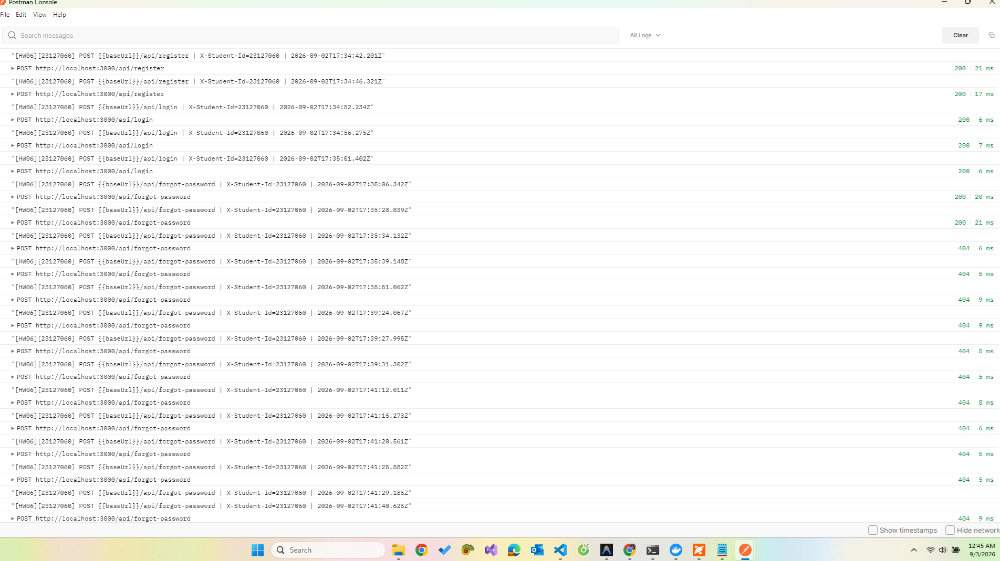

# STEP 5 — Các tính năng Postman em đã sử dụng

> HW06 — API Testing | SV **Ninh Văn Khải — 23127060** | Đề bài mục 6

Đề bài: *"Exercise as many Postman features as you reasonably can... List the Postman
features you used in your report."*

---

## 1. Bảng tổng hợp

Cột **Bằng chứng** ghi rõ file hoặc thao tác nào chứng minh tính năng đó em đã dùng thật.

| # | Tính năng | Em dùng vào việc gì trong bài này | Bằng chứng |
|---|---|---|---|
| 1 | **Collection** | 7 collection: 3 bộ đầy đủ, 3 bộ hồi quy `@contract`, 1 bộ data-driven | `postman/collections/*.json` |
| 2 | **Folder trong collection** | Mỗi collection chia 5 folder: `_setup` + 4 nhóm kỹ thuật DOM / STA / SEC / SCH | cấu trúc `item[]` trong file collection |
| 3 | **Environment** | `23127060_local` với 26 biến | `postman/environments/23127060_local.postman_environment.json` |
| 4 | **Biến môi trường** | `{{baseUrl}}`, `{{token_user}}`, `{{token_admin}}`, `{{token_attacker}}`, `{{orderId}}`, `{{resetToken}}`, `{{newProductId}}`... | dùng xuyên suốt request và script |
| 5 | **Biến collection** | Các JSON Schema được nạp thành biến `schema_product`, `schema_order`, `schema_error`... | `variable[]` trong collection |
| 6 | **Pre-request script cấp collection** | Chèn header `X-Student-Id` + `console.log` cho **mọi** request | 823/823 request mang header — `ci/evidence/header_evidence.md` |
| 7 | **Pre-request script cấp request** | Đưa hệ thống về đúng precondition của từng case: tạo đơn hàng rồi đẩy về trạng thái `shipping`, xin OTP mới, đếm số bản ghi trước khi gọi | `event[listen=prerequest]` của từng item |
| 8 | **Tests script cấp collection** | Hai phép kiểm áp cho mọi response: thời gian phản hồi, mã trạng thái hợp lệ | `event[listen=test]` cấp collection |
| 9 | **Tests script cấp request** | 1146 assertion cho 243 test case | `newman/*.json.gz` |
| 10 | **JSON Schema validation** (`pm.response.to.have.jsonSchema`) | 13 schema, dùng `additionalProperties: false` để bắt trường thừa và `exclusiveMinimum` để bắt giá trị sai | `postman/scripts/schemas/*.json` |
| 11 | **`pm.sendRequest`** | Đọc lại tài nguyên sau khi gọi (kiểm tác dụng phụ), tạo tài khoản cách ly, đẩy trạng thái đơn hàng | khoảng 90 lần gọi trong các script |
| 12 | **Data-driven run** (Collection Runner + data file) | 4 bộ, 48 vòng lặp, 4 file CSV | `postman/data/*.csv`, `newman/23127060_DD-*` |
| 13 | **`pm.iterationData`** | Đọc giá trị từng dòng của data file trong script | folder `DD1`–`DD4` |
| 14 | **Newman CLI** | Chạy tự động toàn bộ, dùng trong CI | `agent-skill/.../run_newman.sh` |
| 15 | **Reporter `htmlextra`** | Báo cáo HTML, có `--reporter-htmlextra-logs` để giữ lại `console.log` | `newman/*.html` |
| 16 | **Reporter `json`** | Đầu vào cho các script tổng hợp và kiểm chứng | `newman/*.json.gz` |
| 17 | **`--folder`** | Chạy riêng từng folder với data file riêng của nó | `run_datadriven.sh` |
| 18 | **`--export-environment`** | Chuyển token từ lần chạy `_setup` sang lần chạy data-driven | `run_datadriven.sh` |
| 19 | **`--env-var`** | Ghi đè `baseUrl` và `studentId` từ dòng lệnh (CI dùng) | workflow GitHub Actions |
| 20 | **Postman Console** | Đọc dòng `[HW06][23127060] ...` để chụp màn hình làm bằng chứng | **HUMAN H4** — xem mục 4 |
| 21 | **Mock server** | Đối chiếu hợp đồng API theo đặc tả với hành vi thực tế | **HUMAN** — xem mục 5 |
| 22 | **Monitor** | Chạy bộ `@contract` định kỳ | **HUMAN** — xem mục 5 |
| 23 | **Workspace** | Workspace cá nhân `HW06-23127060` chứa 7 collection + 1 environment | **HUMAN** — xem mục 5 |

**Tổng: 23 tính năng, trong đó 19 tính năng có bằng chứng tự động kiểm chứng được.**
Bốn tính năng còn lại (20–23) cần thao tác trên giao diện Postman và tài khoản Postman.

## 2. Cấu trúc collection

```
23127060_HW06_API-3
├── _setup - chuan bi du lieu va token
│   ├── 00 Dang ky user nan nhan
│   ├── 01 Dang ky user tan cong
│   ├── 02 Login nan nhan       -> token_user, userId
│   ├── 03 Login ke tan cong    -> token_attacker, attackerId
│   ├── 04 Login admin          -> token_admin, adminId
│   ├── 05 Tao san pham vat thu -> newProductId
│   └── 06 Dem so san pham ban dau
├── DOM - Domain partition        (53 request)
├── STA - State transition        (9 request)
├── SEC - Security SEC-01..07     (16 request)
└── SCH - Schema validation       (8 request)
```

Folder `_setup` chạy đầu tiên và đặt toàn bộ biến mà các folder sau cần. Nhờ vậy collection
chạy được từ con số không trên một CSDL vừa seed lại, không đòi thao tác tay nào.

## 3. Hai quyết định kỹ thuật em muốn ghi lại

### 3.1 Em không đặt phép kiểm "không lộ password" ở cấp collection

`references/POSTMAN_GUIDE.md` ban đầu đề nghị đặt ba phép kiểm chung ở cấp collection, trong
đó có *"không lộ trường nhạy cảm"* và *"Content-Type là application/json"*. Em đã **bỏ** hai
phép kiểm đó khỏi cấp collection.

Lý do: chúng thất bại ở một số request — nhưng đó là bug **A-07** (login trả về cả `password`)
và **C-03** (lỗi SQL trả về HTML). Nếu để ở cấp collection, mỗi bug sẽ bị đếm lại **hàng chục
lần**, mỗi lần một request, và số liệu `failed` trong báo cáo Newman sẽ nói về số lượng bug
gấp nhiều lần sự thật. Hai bug đó đã có test case riêng phơi bày chúng đúng một lần mỗi cái.

Bài học em rút ra: **một phép kiểm chỉ nên đặt ở cấp collection khi nó đúng với mọi request.**
Đặt một phép kiểm của tình huống cụ thể lên cấp collection làm hỏng phép đếm, chứ không làm
tăng độ phủ.

### 3.2 Cách ly tài khoản cho các case đăng nhập

SUT có bug **A-09**: mỗi lần đăng nhập sai cộng **+2** vào `login_attempts` và khóa 180 giây
khi đạt 3. Hậu quả khi chạy Newman: chỉ cần **một** case thử mật khẩu sai là tài khoản
`api.victim` bị khóa, và **mọi** case đăng nhập chạy sau đó đều trả 403 — kể cả những case
hoàn toàn không liên quan. Lần chạy đầu tiên của em có đúng hiện tượng này: 7 case thất bại
dây chuyền từ một nguyên nhân duy nhất.

Không có endpoint nào mở khóa, và chờ 180 giây trong CI là không chấp nhận được. Giải pháp
em chọn là tầm collection cách ly: 8 case dùng `/api/login` **tự tạo một tài khoản riêng**
trong pre-request script, rồi tự đưa tài khoản đó về đúng trạng thái mình cần (`fresh`,
`fail2`, `reset`, `fail2_then_reset`). Xem bảng `ISOLATED` trong `build_collection.py`.

Đây là việc của **tầng thực thi**, không phải của thiết kế test case, nên em xử lý nó trong
bộ dựng collection chứ không sửa vào file CSV test case.

## 4. Bằng chứng header `X-Student-Id` (đề bài mục 11)

Header được chèn ở pre-request script cấp **collection**, nên không request nào có thể thiếu:

```javascript
const STUDENT_ID = pm.environment.get("studentId") || "23127060";
pm.request.headers.upsert({ key: "X-Student-Id", value: STUDENT_ID });
pm.request.headers.upsert({ key: "Accept", value: "application/json" });

console.log(
  "[HW06][" + STUDENT_ID + "] " +
  pm.request.method + " " + pm.request.url.toString() +
  " | X-Student-Id=" + STUDENT_ID +
  " | " + new Date().toISOString()
);
```

Bằng chứng em thu ở **hai mức**:

1. **Kiểm chứng tự động** — `scripts/verify_header.py` đọc thẳng phần `request.header` mà
   Newman ghi lại cho từng request thật sự rời đường:
   **823/823 request mang `X-Student-Id: 23127060`, không request nào thiếu.**
   Kết quả ở `ci/evidence/header_evidence.md`.
2. **Ảnh chụp màn hình** — dòng `console.log` trên xuất hiện trong báo cáo HTML (nhờ
   `--reporter-htmlextra-logs`) và trong Postman Console.

> Một dòng `console.log` chỉ chứng minh **script đã chạy**, chưa chứng minh **header đã được
> gửi**. Vì vậy cách thứ nhất mới là bằng chứng thật; ảnh chụp Console em nộp kèm cho đúng
> yêu cầu hình thức của đề bài.

### HUMAN H4 — cách chụp màn hình Postman Console

1. Mở Postman → import `postman/collections/23127060_HW06_API-1.postman_collection.json`
   và `postman/environments/23127060_local.postman_environment.json`.
2. Chọn environment `23127060_local` ở góc trên bên phải.
3. Mở Console: **View → Show Postman Console** (hoặc `Ctrl+Alt+C`).
4. Chạy bất kỳ request nào trong folder `DOM`.
5. Trong Console, mở rộng mục `Request Headers` của request vừa chạy — phải thấy dòng
   `X-Student-Id: 23127060`, kèm dòng log `[HW06][23127060] POST ... | X-Student-Id=23127060`.
6. Chụp toàn màn hình (phải thấy rõ cả dòng header lẫn dòng log) →
   lưu vào `bugs/screenshots/console_header.png`.

**✅ Đã chụp — `bugs/screenshots/console_header.png`:**



Ảnh chụp thấy rõ chuỗi dòng log `[HW06][23127060] POST ... | X-Student-Id=23127060`
cho từng request (`register`, `login`, `forgot-password`...) — đúng định dạng mà
pre-request script cấp collection sinh ra, khớp với bằng chứng tự động ở
`ci/evidence/header_evidence.md` (823/823 request mang header).

## 5. Bốn tính năng cần thao tác trên giao diện Postman (HUMAN)

### H4a — Workspace
Tạo workspace cá nhân tên `HW06-23127060`, import cả 7 collection và environment vào đó.
Chụp màn hình danh sách collection → `ci/evidence/postman_workspace.png`.

### H4b — Mock server
1. Trong Postman: **New → Mock Server**, chọn collection `23127060_HW06_API-3`.
2. Thêm một example cho `GET /api/products/2` với body **đúng đặc tả**:
   `{"id":2,"name":"Samsung Galaxy S24 Ultra","price":28000000,...}` — chú ý `price` là **số**.
3. Chạy cùng một test case về schema lên cả mock server và lên SUT thật.
   Mock **pass**, SUT thật **fail** — đó chính là bug **C-05** (`price` bị ép thành chuỗi với id chẵn).
4. Chụp màn hình hai kết quả cạnh nhau → `ci/evidence/postman_mock.png`.

> Ý nghĩa: mock server ở đây em không dùng để thay thế SUT, mà để **hiện thực hóa hợp đồng API
> theo đặc tả**. Sự khác nhau giữa mock và SUT chính là bug, và đó là cách dùng mock server
> có giá trị nhất trong bài này.

### H4c — Monitor
1. **New → Monitor**, chọn collection `23127060_HW06_API-1_contract` và environment `23127060_local`.
2. Đặt lịch 1 lần/ngày.
3. Lưu ý: monitor của Postman chạy trên máy chủ của Postman nên **không gọi được `localhost`**.
   Muốn monitor thật sự chạy thì phải đưa SUT ra địa chỉ công khai (ví dụ bằng ngrok). Nếu
   không làm được thì chụp màn hình cấu hình monitor và **ghi rõ hạn chế này trong báo cáo** —
   không được báo là đã chạy thành công.
4. Chụp màn hình → `ci/evidence/postman_monitor.png`.

### H4d — Visualizer (tùy chọn)
Thêm vào tests script của một request bất kỳ đoạn `pm.visualizer.set(template, data)` để vẽ
bảng tổng hợp kết quả, rồi chụp tab **Visualize**.
