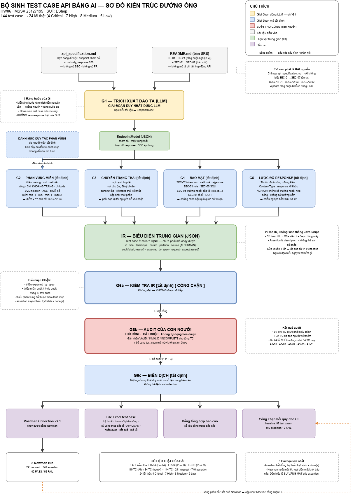

# Sơ đồ thiết kế — ✅ ĐÃ VẼ XONG

| | |
|---|---|
| **Bản vẽ** | [`ai_test_generator_diagram.png`](./ai_test_generator_diagram.png) |
| **File nguồn** | [`ai_test_generator_diagram.drawio`](./ai_test_generator_diagram.drawio) — mở lại được bằng [app.diagrams.net](https://app.diagrams.net) |
| **Công cụ** | draw.io · do sinh viên 23127195 tự dựng |
| **Đã nhúng vào** | [`docs/00_MAIN_REPORT.md`](../../docs/00_MAIN_REPORT.md) §4 |

---

## Vì sao thư mục này từng không có file sơ đồ

Đề bài, mục **§7** và **§11 (Anti-AI-Cheat)**, quy định:

> *"Provide a **self-drawn** diagram and pseudocode of the design. ("Self-drawn" means you make
> the design decisions; any diagramming tool is fine, but **the diagram itself must not be
> AI-generated**.)"*

Vì vậy sơ đồ **không** được sinh bằng AI. Thay vào đó, tài liệu
[HUONG_DAN_VE_SO_DO.md](./HUONG_DAN_VE_SO_DO.md) chỉ cung cấp **kiến thức nền và thao tác công cụ**
— toàn bộ quyết định về bố cục, phân nhóm màu và cách sắp xếp là của sinh viên. File nguồn
`.drawio` được giữ lại làm bằng chứng cho quá trình dựng hình.

Danh sách kiểm tra dưới đây là tiêu chí đã dùng để đối chiếu bản vẽ trước khi chốt.

---

## Danh sách kiểm tra — sơ đồ phải thể hiện được

Đây là **danh sách nội dung**, không phải bản vẽ. Cách bố trí, hình khối, màu sắc là quyết
định của bạn.

### Bắt buộc có

- [x] **Hai nguồn đầu vào tách biệt:** `api_specification.md` và `README.md` (SRS).
      Phải thấy rõ đây là hai tài liệu khác nhau — đó là một phát hiện quan trọng của bài
      (SEC-01…SEC-07 chỉ nằm ở SRS, không có trong đặc tả API).
- [x] **Sáu giai đoạn G1 → G6** với tên và thứ tự đúng như DESIGN.md §3.
- [x] **Phân biệt trực quan giữa "dùng LLM" và "mã tất định".**
      Chỉ **G1** dùng LLM; G2–G6 là mã tất định. Đây là ý trung tâm của thiết kế nên phải
      nhìn phát ra ngay — dùng màu khác, nét viền khác, hoặc chú thích rõ.
- [x] **IR (biểu diễn trung gian)** vẽ như một hiện vật riêng nằm giữa luồng, không phải
      một mũi tên. Ghi rõ nó là JSON.
- [x] **G6b — Audit của con người** đánh dấu là **thủ công / bắt buộc**, phân biệt rõ với
      các bước tự động. Đây là ranh giới trách nhiệm của thiết kế.
- [x] **Bốn đầu ra từ IR:** Postman Collection · file Excel test case · bảng tổng hợp báo cáo ·
      cổng chặn hồi quy CI. Thể hiện được ý "một nguồn sự thật duy nhất" (nguyên tắc N5).
- [x] **Vòng phản hồi** từ Newman quay lại IR: kết quả chạy dùng để cập nhật allowlist của
      cổng chặn CI.

### Nên có (làm sơ đồ thuyết phục hơn)

- [x] Danh mục quy tắc phân vùng (N2) vẽ như **đầu vào thứ hai** của G2 — cho thấy tính đầy
      đủ đến từ danh mục, không đến từ mô hình.
- [x] Cổng kiểm tra G6a với các điều kiện chặn (thiếu `expected_by_spec`, thiếu nhãn audit,
      assertion bất đồng bộ không bọc try/catch).
- [x] Ghi chú số liệu thật: 144 test case → 24 lỗi.

### Không được có

- [ ] ~~Sơ đồ tải về từ mạng hoặc do AI sinh~~ — vi phạm §11.
- [ ] ~~Ảnh chụp màn hình sơ đồ của người khác~~.

---

## Gợi ý bố cục (mô tả bằng lời, bạn tự dựng)

Bố cục tự nhiên nhất là **dòng chảy từ trên xuống**, chia làm ba băng ngang:

1. **Băng trên — Đầu vào.** Hai hộp tài liệu nằm cạnh nhau, cùng đổ vào G1.
2. **Băng giữa — Đường ống.** G1 (tô màu "LLM") rồi đến G2, G3, G4, G5 (tô màu "tất định")
   cùng đổ vào hộp IR ở chính giữa. Danh mục quy tắc phân vùng đặt bên trái, mũi tên trỏ vào G2.
3. **Băng dưới — Đầu ra.** Từ IR toả ra: G6a (cổng kiểm tra) → G6b (audit thủ công, đánh dấu
   khác biệt) → G6c (biên dịch) → bốn hiện vật đầu ra. Mũi tên phản hồi từ Newman đi ngược
   lên allowlist.

Nếu vẽ tay: một trang A4 nằm ngang là đủ. Viết rõ tên từng giai đoạn, và **chú thích
(legend) cho quy ước màu** — đó là thứ TA nhìn vào đầu tiên để xác nhận bạn hiểu thiết kế.

---

## Sau khi vẽ xong — đã hoàn tất

- [x] Lưu ảnh `ai_test_generator_diagram.png` **và** file nguồn `.drawio` vào thư mục này
- [x] Nhúng vào `docs/00_MAIN_REPORT.md` §4, kèm phần *Cách đọc sơ đồ* giải thích quy ước màu
- [x] Gỡ bản phác ASCII cũ trong báo cáo để không nhập nhằng với §11
- [x] Xuất lại PDF bằng `python scripts/export_pdf.py` (ảnh được nhúng thẳng dạng data URI)
