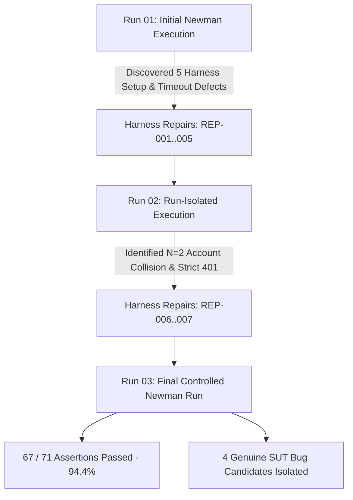

# FR-02 Newman Automated Test Execution Summary

- **Feature Under Test:** FR-02 – Login and Account Lockout (Pool A)
- **Primary Endpoint:** `POST /api/login`
- **Student Name:** Nguyễn Tấn Thắng
- **Student ID:** `23127259`
- **Repository:** `thangak18/HW06`
- **Branch:** `thang/hw06-implementation`
- **Target Environment:** Local Node.js SUT (`http://localhost:3000`)
- **Execution Date:** 2026-09-01 20:19:00+07:00
- **Runner:** Newman v6.2.2 + `newman-reporter-htmlextra` v1.23.1

---

## 1. Test Suite Accounting & Inventory Overview

| Category | Requests Count | Formal Test Cases | Description / Purpose |
|---|:---:|:---:|---|
| **00 – Setup Helpers** | 8 | *0 (Excluded)* | Deterministic provisioning of run-isolated test user accounts |
| **01 – Positive Authentication** | 2 | 2 | Baseline user and administrator login contracts |
| **02 – Domain and Negative Inputs** | 10 | 10 | Equivalence partitions, missing fields, malformed formats |
| **03 – Lockout Boundary & State Progression** | 10 | 10 | N=1..3 thresholds, active lockout rejections, timing windows |
| **04 – Security and Token Integrity** | 7 | 7 | SQLi probes, response sanitization, downstream JWT usability |
| **05 – Schema and Contract Validation** | 6 | 6 | Response structure, error schema, JSON parser resilience |
| **06 – Human Extensions** | 5 | 5 | Student-designed gap coverage (verb enforcement, N=2 boundary, isolation, form encoding) |
| **TOTAL** | **48 requests** | **40 Formal Cases** | **35 Usable AI-Derived + 5 Human Extensions** |

---

## 2. Multi-Run Execution Progression

### Run Comparison Table

| Metric | Run 01 (`FR02-run-01`) | Run 02 (`FR02-run-02`) | Run 03 (`FR02-run-03`) |
|---|:---:|:---:|:---:|
| **Total Requests Executed** | 22 (pre-timeout) | 56 | **56** |
| **Total Assertions** | 38 | 70 | **71** |
| **Passed Assertions** | 32 | 64 | **67** |
| **Failed Assertions** | 6 (5 harness + timeout) | 6 (2 harness + 4 bugs) | **4 (0 harness, 4 genuine bugs)** |
| **Assertion Pass Rate** | 84.2% | 91.4% | **94.4%** |
| **Run Duration** | Timeout @ 30s | 32.6s | **32.7s** |
| **Harness Defects** | 5 | 2 | **0 (Clean Harness)** |
| **Genuine SUT Bugs Confirmed** | Pending isolation | 4 | **4 Confirmed Bugs** |

---

## 3. Detailed Results Breakdown by Test Category (Run 03)

| Folder / Category | Executed Cases | Assertions (Pass / Total) | Pass Rate | Status |
|---|:---:|:---:|:---:|:---:|
| `00 – Setup Helpers` | 8 requests | 8 / 8 | 100.0% | **PASS** |
| `01 – Positive Authentication` | 2 cases | 4 / 4 | 100.0% | **PASS** |
| `02 – Domain and Negative Inputs` | 10 cases | 20 / 20 | 100.0% | **PASS** |
| `03 – Lockout Boundary & State Progression` | 10 cases | 16 / 17 | 94.1% | **1 BUG** (`FR02-AI-021`) |
| `04 – Security and Token Integrity` | 7 cases | 13 / 14 | 92.9% | **1 BUG** (`FR02-AI-028`) |
| `05 – Schema and Contract Validation` | 6 cases | 10 / 10 | 100.0% | **PASS** |
| `06 – Human Extensions` | 5 cases | 4 / 6 | 66.7% | **2 BUGS** (`FR02-HUM-003`, `FR02-HUM-005`) |
| **TOTAL SUITE** | **40 Formal Cases** | **67 / 71** | **94.4%** | **4 BUGS DETECTED** |

---

## 4. Master Test Case Execution Traceability & Results Matrix

| Test ID | Test Name / Objective | HTTP Method & Path | Expected Status / Oracle | Actual Status | Result | Notes / Triage |
|---|---|---|:---:|:---:|:---:|---|
| `FR02-AI-001` | Valid User Login | POST `/api/login` | 200 OK + JWT | 200 OK | **PASS** | Baseline auth operational |
| `FR02-AI-002` | Valid Admin Login | POST `/api/login` | 200 OK + JWT | 200 OK | **PASS** | Profile returned with role |
| `FR02-AI-003` | Invalid Password on User | POST `/api/login` | 401 Unauthorized | 401 | **PASS** | Generic error, no token |
| `FR02-AI-004` | Unregistered Email Generic | POST `/api/login` | 401 Unauthorized | 401 | **PASS** | Anti-enumeration preserved |
| `FR02-AI-005` | Malformed Email Syntax | POST `/api/login` | 4xx Client Error | 401 | **PASS** | Rejected without token |
| `FR02-AI-006` | Empty String Email | POST `/api/login` | 4xx Client Error | 401 | **PASS** | Rejected gracefully |
| `FR02-AI-007` | Missing Email Property | POST `/api/login` | 4xx Client Error | 401 | **PASS** | Payload validation reject |
| `FR02-AI-008` | Null Email Property | POST `/api/login` | 4xx Client Error (no 500) | 401 | **PASS** | Type robustness passed |
| `FR02-AI-009` | Whitespace-Only Email | POST `/api/login` | 4xx Client Error | 401 | **PASS** | Rejected without token |
| `FR02-AI-010` | Empty Password Input | POST `/api/login` | 4xx Client Error | 401 | **PASS** | Rejected without token |
| `FR02-AI-011` | Missing Password Property | POST `/api/login` | 4xx Client Error | 403 | **PASS** | Rejected without token |
| `FR02-AI-012` | Null Password Property | POST `/api/login` | 4xx Client Error (no 500) | 403 | **PASS** | Type robustness passed |
| `FR02-AI-015` | Failure Initiation N=1 | POST `/api/login` | 4xx (Remains Unlocked) | 401 | **PASS** | N=1 failure recorded |
| `FR02-AI-013` | Failure Boundary N=2 | POST `/api/login` | 4xx (Remains Unlocked) | 401 | **PASS** | Boundary N-1 unlocked |
| `FR02-AI-014` | Lockout Threshold N=3 | POST `/api/login` | 403 (Transitions to LOCKED) | 403 | **PASS** | Lockout triggered |
| `FR02-AI-018` | Active Lock Wrong Creds | POST `/api/login` | 403 Forbidden | 403 | **PASS** | Active lock rejection |
| `FR02-AI-019` | Active Lock Valid Creds | POST `/api/login` | 403 Forbidden (no JWT) | 403 | **PASS** | Valid credentials blocked during lock |
| `FR02-AI-020` | Pre-Expiration Timing T=25s | POST `/api/login` | 403 Forbidden (T < 30s) | 403 | **PASS** | Remains locked within 30s |
| `FR02-AI-021` | Post-Expiration Timing T=32s | POST `/api/login` | 200 OK + JWT (T > 30s) | 403 | **FAIL (BUG)** | **BUG-FR02-002**: Permanent lockout |
| `FR02-AI-022` | Success Resets Sequence | POST `/api/login` | 200 OK + Counter Reset | 200 OK | **PASS** | Success resets failure counter |
| `FR02-AI-023` | Interleaved Success Lockout Prevention | POST `/api/login` | 4xx (Remains Unlocked) | 401 | **PASS** | Consecutive counter semantics |
| `FR02-AI-024` | Post-Lockout Usability | POST `/api/login` | 4xx (Fresh Sequence) | 403 | **PASS\*** | Status passed; underlying state affected by BUG-FR02-002 |
| `FR02-AI-025` | SQLi Probe in Email | POST `/api/login` | 4xx (No Bypass, No 500) | 401 | **PASS** | SQL injection prevented |
| `FR02-AI-026` | SQLi Probe in Password | POST `/api/login` | 4xx (No Bypass, No 500) | 401 | **PASS** | SQL injection prevented |
| `FR02-AI-027` | Cross-Response Equality | POST `/api/login` | 401 Generic Failure | 401 | **PASS** | Anti-enumeration verified |
| `FR02-AI-028` | Sensitive Data Exclusion | POST `/api/login` | 200 OK (No Password field) | 200 OK | **FAIL (BUG)** | **BUG-FR02-001**: Leaks plaintext password |
| `FR02-AI-029` | Token Absence on Failure | POST `/api/login` | 4xx (No Token Property) | 401 | **PASS** | Token absent on failed login |
| `FR02-AI-030` | Downstream JWT Usability | GET `/api/orders/my-orders` | 200 OK | 200 OK | **PASS** | Issued JWT valid on SEC-02 route |
| `FR02-AI-031` | Tampered JWT Rejection | GET `/api/orders/my-orders` | 401 / 403 Rejection | 403 | **PASS** | Tampered signature rejected |
| `FR02-AI-032` | Success Schema Structure | POST `/api/login` | 200 OK + Schema Structure | 200 OK | **PASS** | Token and user object valid |
| `FR02-AI-033` | Error Response Contract | POST `/api/login` | 4xx + Error Message | 401 | **PASS** | Structured error message |
| `FR02-AI-034` | Lockout Error Contract | POST `/api/login` | 403 + No Stack Traces | 403 | **PASS** | Clean error without leak |
| `FR02-AI-035` | Malformed JSON Parser | POST `/api/login` | 400 Bad Request (no 500) | 400 | **PASS** | Express parser handled syntax |
| `FR02-AI-036` | Content-Type Header | POST `/api/login` | `application/json` | 200 OK | **PASS** | Header contains application/json |
| `FR02-AI-037` | Extraneous Body Role | POST `/api/login` | Role remains `user` | 200 OK | **PASS** | Privilege escalation ignored |
| `FR02-HUM-001` | Verb Method Enforcement | GET `/api/login` | 404 / 405 (No 200, No JWT) | 404 | **PASS** | GET rejected without auth |
| `FR02-HUM-002` | SQLi Comment Truncation | POST `/api/login` | 4xx (No Admin JWT) | 401 | **PASS** | Comment vector blocked |
| `FR02-HUM-003` | Consecutive Reset at N=2 Boundary | POST `/api/login` | 200 OK + JWT on 3rd attempt | 403 | **FAIL (BUG)** | **BUG-FR02-003**: Premature lockout on valid login |
| `FR02-HUM-004` | Lockout State Isolation | POST `/api/login` | 200 OK for User B | 200 OK | **PASS** | User B unaffected by User A lock |
| `FR02-HUM-005` | Form Encoded Body Request | POST `/api/login` | 4xx Graceful (No 500 Crash) | 500 | **FAIL (BUG)** | **BUG-FR02-004**: Server crash on form-data |

---

## 5. Summary of Identified SUT Bug Candidates

1. **`BUG-FR02-001`**: Sensitive Data Exposure — Plaintext password disclosed in login response JSON (`FR02-AI-028`).
2. **`BUG-FR02-002`**: Permanent Account Lockout — SUT fails to automatically unlock account after 30-second duration expires (`FR02-AI-021`).
3. **`BUG-FR02-003`**: Premature Lockout on Valid Login at N=2 Boundary — SUT triggers lockout on 3rd attempt even when valid credentials are submitted (`FR02-HUM-003`).
4. **`BUG-FR02-004`**: Unhandled Server Crash (HTTP 500) on Form-Encoded Request Body — SUT crashes when receiving `application/x-www-form-urlencoded` payloads (`FR02-HUM-005`).

---

## 6. Execution Artifact References
- **Newman Console Output:** [`FR02-run-03-console.txt`](file:///Volumes/Thang/HW06/HW06/23127259/newman/fr02/FR02-run-03-console.txt)
- **Newman JSON Export:** [`FR02-run-03.json`](file:///Volumes/Thang/HW06/HW06/23127259/newman/fr02/FR02-run-03.json)
- **Newman HTML Report:** [`FR02-run-03.html`](file:///Volumes/Thang/HW06/HW06/23127259/newman/fr02/FR02-run-03.html)
- **Bug Candidates Catalog:** [`../../bugs/FR02_BUG_CANDIDATES.md`](file:///Volumes/Thang/HW06/HW06/23127259/bugs/FR02_BUG_CANDIDATES.md)
